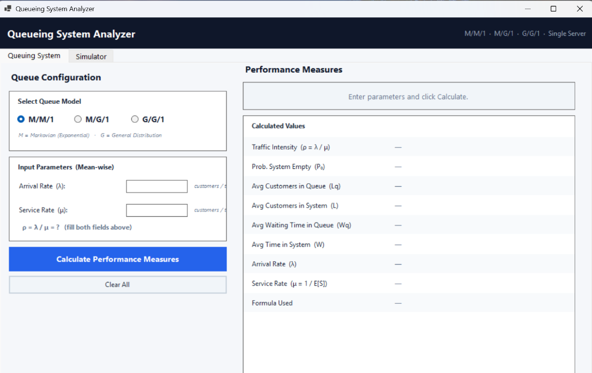
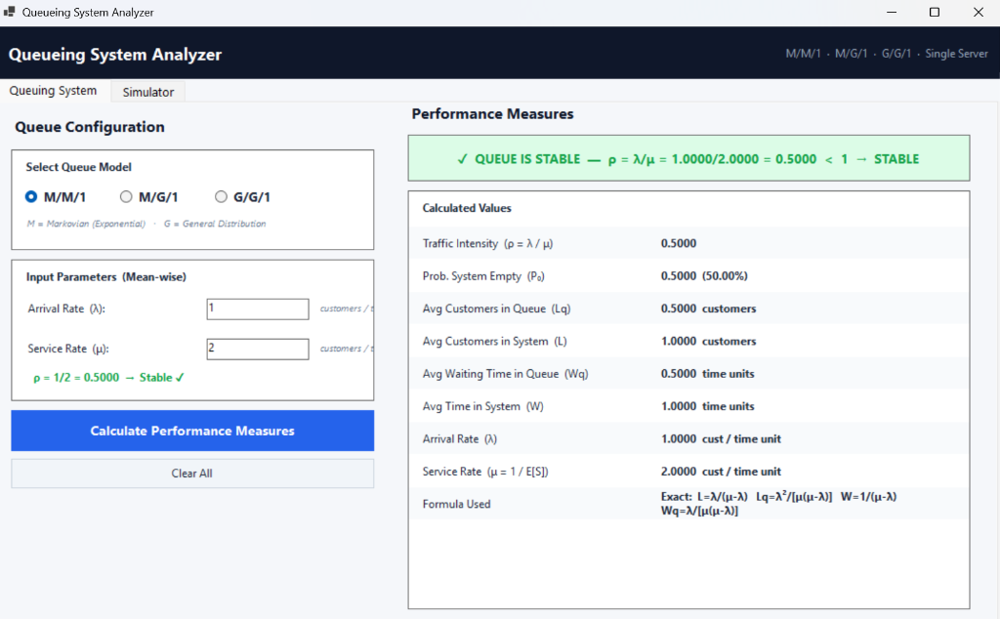
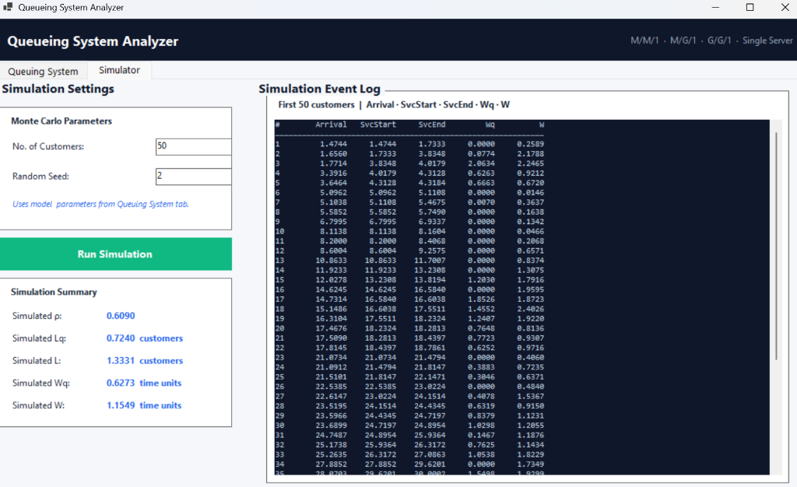
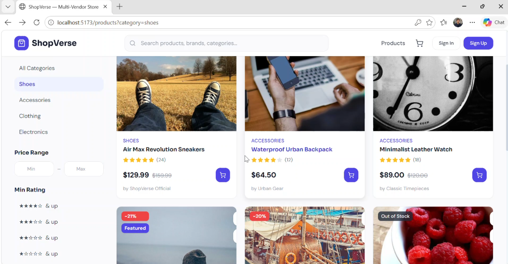

<div align="center">

  <!-- Animated Wave Banner -->
  

  <!-- Typing Animation -->
  

  <!-- Profile Badges -->
  <br/>
  <a href="https://github.com/MuhammadBilalulhaq"></a>
  &nbsp;
  
  &nbsp;
  

</div>

<br/>

<!-- ═══════════════════════════════════════════════════════ -->

##  &nbsp;About Me

```yaml
name: Muhammad Bilal Ul Haq
role: Computer Science Student & Aspiring Full-Stack Developer
location: Karachi, Pakistan
university: UBIT DCS, Karachi University

currently_building: ShopVerse — a full-stack multi-vendor e-commerce platform
currently_learning: [ "Data Structures & Algorithms", "Full-Stack Development", "System Design" ]

fun_fact: "I learn best by building, breaking, and rebuilding things 🔧"
```

<br/>

<!-- ═══════════════════════════════════════════════════════ -->

## 🛠️ &nbsp;Tech Stack

<div align="center">

| Category | Technologies |
|:--------:|:------------|
| **Languages** |     |
| **Frontend** |    |
| **Database** |  |
| **Tools** |    |

</div>

<br/>

<!-- ═══════════════════════════════════════════════════════ -->

## 🏆 &nbsp;GitHub Trophies

<div align="center">
  
</div>

<br/>

<!-- ═══════════════════════════════════════════════════════ -->

## 📊 &nbsp;GitHub Stats & Streak

<div align="center">

  <!-- GitHub Stats Card -->
  
  &nbsp;&nbsp;
  <!-- Top Languages Card -->
  

  <br/><br/>

  <!-- 🔥 GitHub Streak Stats -->
  

  <br/><br/>

  <!-- Contribution Graph -->
  

</div>

<br/>

<!-- ═══════════════════════════════════════════════════════ -->

## 📌 &nbsp;Featured Projects

<!-- ─────────── Queueing System Analyzer ─────────── -->

<div align="center">
  <a href="https://github.com/MuhammadBilalulhaq/Queuing-System-Simulator">
    
  </a>
</div>

<br/>

> **A C# WinForms desktop application** that analyzes **M/M/1**, **M/G/1**, and **G/G/1** single-server queueing models. Enter arrival/service rates and it computes traffic intensity, queue length, waiting time, and system stability. Includes a Monte Carlo **Simulator** tab that runs event-driven simulations and logs per-customer arrival, service, and wait times.

<p align="center">
  
  
  
  
</p>

<div align="center">
  <table>
    <tr>
      <td align="center"><b>⚙️ Queue Configuration</b></td>
      <td align="center"><b>✅ Performance Results</b></td>
      <td align="center"><b>🎲 Monte Carlo Simulation</b></td>
    </tr>
    <tr>
      <td></td>
      <td></td>
      <td></td>
    </tr>
  </table>
</div>

<br/>

---

<!-- ─────────── ShopVerse ─────────── -->

<div align="center">
  <a href="https://github.com/MuhammadBilalulhaq/shopverse-frontend">
    
  </a>
</div>

<br/>

> **A full-stack multi-vendor e-commerce platform** with product browsing, category & price filters, star ratings, discounts, and a complete cart/sign-up flow. Frontend built with a modern JS framework; backend in Java handles the store logic and data.

<p align="center">
  
  
  
  
</p>

<div align="center">
  
</div>

<br/>

---

<!-- ─────────── Other Projects ─────────── -->

<div align="center">

<table>
<tr>
<td width="50%" valign="top">

###  &nbsp;[DSA Labs](https://github.com/MuhammadBilalulhaq/DSA-Labs)

> Implementations of arrays, linked lists, stacks, queues, trees, and graphs — built while mastering core data structures and algorithms.

<p>


</p>

</td>
<td width="50%" valign="top">

###  &nbsp;[Web & App Dev Assignments](https://github.com/MuhammadBilalulhaq/Smit-Modern-Web-and-App-development-With-Ai-Assignment)

> Coursework and projects from an ongoing modern web & app development track with AI integration.

<p>


</p>

</td>
</tr>
</table>

<br/>

<a href="https://github.com/MuhammadBilalulhaq?tab=repositories">
  
</a>

</div>

<br/>

<!-- ═══════════════════════════════════════════════════════ -->

## 🐍 &nbsp;Contribution Snake

<div align="center">
  <picture>
    <source media="(prefers-color-scheme: dark)" srcset="https://raw.githubusercontent.com/MuhammadBilalulhaq/MuhammadBilalulhaq/output/github-snake-dark.svg" />
    <source media="(prefers-color-scheme: light)" srcset="https://raw.githubusercontent.com/MuhammadBilalulhaq/MuhammadBilalulhaq/output/github-snake.svg" />
    
  </picture>
</div>

<br/>

<!-- ═══════════════════════════════════════════════════════ -->

## 🤝 &nbsp;Let's Connect

<div align="center">
  <a href="https://github.com/MuhammadBilalulhaq">
    
  </a>
  &nbsp;
  <a href="https://www.linkedin.com/in/muhammad-bilal-ul-haq-78301a30a/">
    
  </a>
</div>

<br/>

<!-- ═══════════════════════════════════════════════════════ -->

<div align="center">

  

  <br/>

  

  <br/><br/>

  <i>"Code is like humor. When you have to explain it, it's bad." — Cory House</i>

</div>
